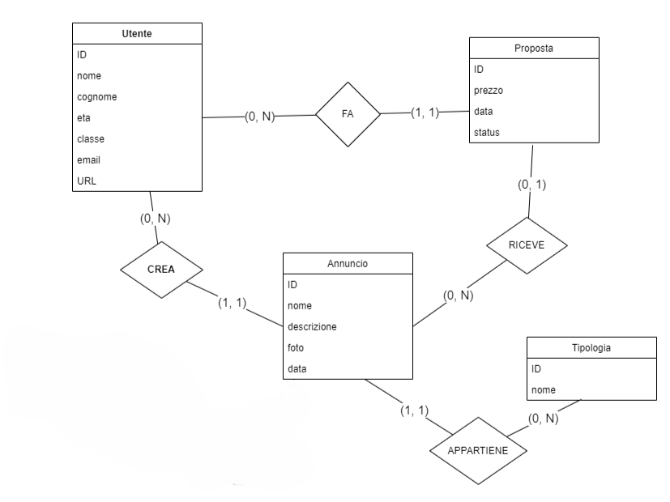

Progetto sito web completo per la vendita di beni da parte di utenti registrati in tutta italia.

**Tecnologie utilizzate:**
- Progettazione -> [Draw.io](https://draw.io)
- Front end -> html, css, js
- Back end -> php, mySql
---
### 1. Progettazione

In questa fase è avvenuta la progettazione del diagramma ER:

Il gruppo ha ritenuto necessario specificare la `tipologia` dell'`annuncio` in una tabella separata per seguire le regole di normalizzazione.

Dopo una prima revisione e normalizzazione è iniziato lo sviluppo del codice SQL per la creazione del DataBase `tardi`. Il codice è stato testato sul servizio `PhpMyAdmin` e ne è stato verificato il corretto funzionamento.

---

### 2. Sviluppo Web 

Il gruppo ha deciso di iniziare con lo sviluppo del back-end per avere una struttura di base del sito per poi sviluppare il front-end successivamente.
Lo sviluppo è iniziato dalla creazione della pagina di connessione al DataBase MySQL tramite la libreria PHP `MySQLi`, è stata progetta come prima la query per il filtraggio degli annunci in base alla tipologia e successivamente è stata sviluppata la pagina di registrazione e di log-in con i rispettivi script e controlli dell'hash della password `SHA256`. Assieme alle pagine è stato implementato del codice JavaScript per mostrare o nascondere la password inserita e per controllare, in fase di registrazione, la conferma della password.

In una successiva fase è stata creata la pagina per la gestione dell'utente e lo script per creare un annuncio visibile nella index, anch'essa ultimata.

Infine è stata implementata la funzione di proporre un'offerta per qualsiasi articolo nella index (gli articoli pubblicati dal venditore che ha eseguito l'accesso non sono visibili) tramite codice JavaScript e PHP, e la possibilità per l'utente a cui è stata inviata l'offerta di accettare o rifiutare, questo sempre con degli script php su pagine dedicate.

È stata poi creata una bozza di grafica CSS per le nuove pagine.

È stata poi sviluppata la parte front-end con il framework CSS `Bootstrap` per tutte le pagine accompagnata da una necessaria revisione del codice.

---

### 3. Hosting

Il gruppo ha caricato una versione semi-definitiva del sito sul servizio di hosting `altervista` tramite `FileZilla` ed e' stato creato il databse.
